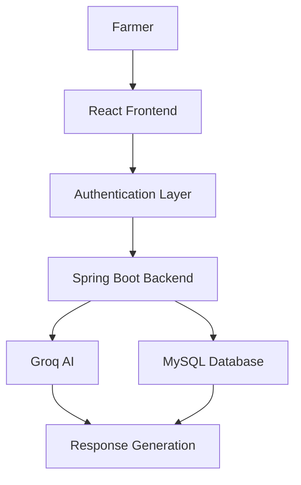
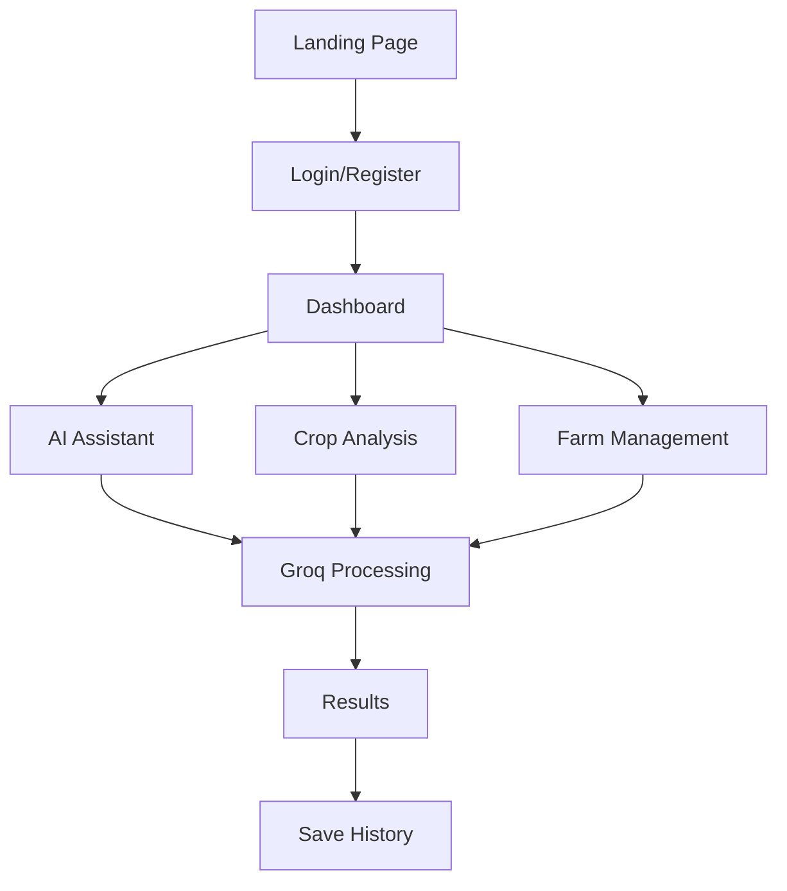
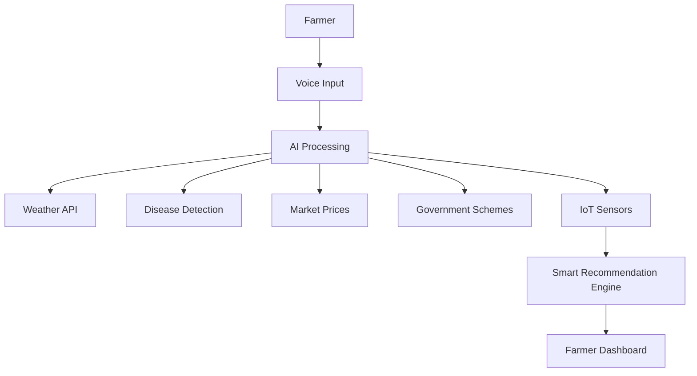

<div align="center">

# 🌱 KrishiMitra
### AI-Powered Smart Agriculture Platform for Maharashtra Farmers


<p align="center">
AI-powered smart agriculture platform designed to help farmers with crop disease detection, multilingual assistance, crop guidance, and farm management.
</p>


</div>

---

# Project Status

## Currently Under Active Development

KrishiMitra is currently in the development phase and new features are continuously being added.

Current version includes core modules while future intelligent systems are under implementation.

---

# About Project

KrishiMitra is an AI-powered agricultural platform developed to help Maharashtra farmers by providing:

✔ Crop Disease Detection  
✔ AI Agricultural Assistance  
✔ Personalized Farming Guidance  
✔ Farm Management  
✔ Daily Farming Tasks  
✔ Multilingual Support  
✔ Smart Recommendations  

---

# Problem Statement

Farmers face challenges including:

- Crop disease identification
- Delayed guidance
- Language barriers
- Lack of personalized recommendations
- Limited monitoring systems

KrishiMitra aims to provide one intelligent platform to solve these issues.

---

# Features

<table>
<tr>

<td>

### Authentication

- Register
- Login
- Logout
- Forgot Password
- JWT Authentication

</td>

<td>

### AI Assistant

- Dynamic Chatbot
- Farming Guidance
- Crop Recommendations
- Fertilizer Suggestions

</td>

</tr>

<tr>

<td>

### Crop Analysis

- Image Upload
- Disease Detection
- Solutions
- Prevention Suggestions

</td>

<td>

### Farm Management

- Farm Details
- Crop Details
- Smart Tasks
- Reminders

</td>

</tr>

</table>

---

# Tech Stack

<div align="center">

### Frontend


### Backend


### Database


### Tools & AI


</div>

---

# System Architecture



---

# Current Project Flow



---

# Future Project Flow



---

# Future Enhancements

### Planned Features

- Voice Assistant in Marathi
- Weather Prediction
- Market Price Tracking
- Government Scheme Recommendations
- IoT Sensor Integration
- Smart Notifications
- Satellite Monitoring

---

# Folder Structure

```bash
KrishiMitra/

├── frontend/
│
│   ├── public/
│   │   ├── favicon.ico
│   │   ├── banner.png
│   │   └── logo.png
│   │
│   └── src/
│       ├── assets/
│       ├── components/
│       ├── pages/
│       ├── services/
│       ├── layouts/
│       ├── context/
│       └── routes/

│
├── backend/
│   ├── controllers/
│   ├── models/
│   ├── services/
│   ├── routes/
│   └── configuration/

└── README.md
```

---

# Installation

Clone repository:

```bash
git clone https://github.com/yourusername/KrishiMitra.git
```

Move into project:

```bash
cd KrishiMitra
```

Frontend:

```bash
cd frontend
npm install
npm run dev
```

Backend:

```bash
cd backend
mvn spring-boot:run
```

---

# Environment Variables

Create `.env`

```env
GROQ_API_KEY=your_api_key
JWT_SECRET=your_secret_key
DATABASE_URL=your_database_url
```

---

# Screenshots

Add screenshots below:

- Landing Page
- Dashboard
- AI Assistant
- Crop Analysis
- Farm Management

---

# Learning Outcomes

- Full Stack Development
- REST APIs
- Authentication
- Database Design
- AI Integration
- Clean Architecture
- State Management
- Problem Solving

---

# Contributions

Contributions and suggestions are welcome.

---

<div align="center">

### Developed by Aadesh Khamkar

© 2026 Aadesh Khamkar | All Rights Reserved

</div>
