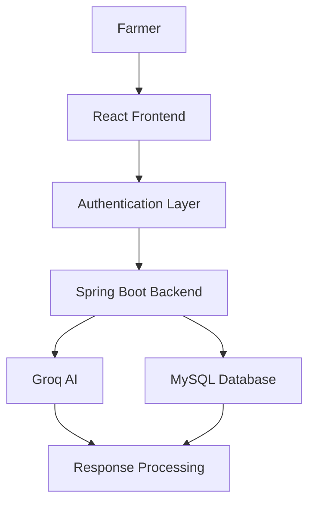
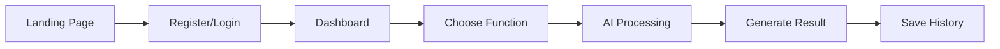
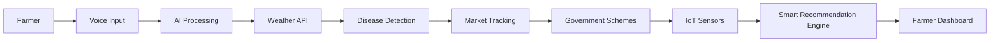

<div align="center">


<br>

# 🌱 KrishiMitra

### AI-Powered Smart Agriculture Platform for Maharashtra Farmers

<p align="center">
AI-powered agriculture platform designed to help farmers with crop disease detection, multilingual AI assistance, personalized recommendations, and smart farm management.
</p>

<p align="center">


</p>

</div>

---

# 🚀 Project Status

## ⚠️ Currently Under Active Development

KrishiMitra is currently in an active development phase and new features are continuously being added.

Current implementation includes:

✅ Authentication System  
✅ AI Chatbot  
✅ Crop Disease Detection  
✅ Farm Management  
✅ Dashboard  
✅ Multilingual Support  

Upcoming intelligent features are still under development.

---

# 📖 About Project

KrishiMitra is an AI-powered smart agriculture platform developed specifically for Maharashtra farmers.

The main goal of this project is to help farmers make smarter farming decisions using Artificial Intelligence and modern technologies.

This platform provides:

✔ AI Crop Disease Detection

✔ Smart Agricultural Assistance

✔ Personalized Recommendations

✔ Farm Management

✔ Daily Farming Tasks

✔ Multilingual Support

✔ Intelligent Suggestions

---

# ❗ Problem Statement

Farmers commonly face problems such as:

- Difficulty identifying crop diseases
- Delayed farming guidance
- Language barriers
- Limited agricultural support
- Lack of personalized recommendations
- Crop monitoring difficulties

KrishiMitra provides an AI-powered solution to simplify these challenges.

---

# ✨ Features

<table>

<tr>

<td width="50%">

## 🤖 AI Agricultural Assistant

- Smart AI Chatbot
- Dynamic Responses
- Farming Guidance
- Crop Recommendations
- Fertilizer Suggestions
- Harvest Guidance

</td>

<td width="50%">

## 🌾 Crop Disease Detection

- Upload Crop Image
- Disease Detection
- Severity Analysis
- Cause Identification
- Solution Suggestions
- Prevention Methods

</td>

</tr>

<tr>

<td width="50%">

## 🚜 Farm Management

- Farm Details
- Crop Details
- Plantation Information
- Smart Scheduling
- Notifications

</td>

<td width="50%">

## 🌍 Multilingual Support

- Marathi
- Hindi
- English

</td>

</tr>

</table>

---

# 💻 Tech Stack

<div align="center">

### Frontend


<br><br>

### Backend


<br><br>

### Database


<br><br>

### AI & Tools


<br><br>


</div>

---

# 🏗️ System Architecture



---

# 🔄 Current Project Flow



---

# 🔮 Future Project Flow



---

# 📌 Future Enhancements

### Planned Features

🎤 Voice Assistant

☁️ Weather Prediction

📈 Market Price Tracking

🏛 Government Scheme Suggestions

🔔 Smart Notifications

📡 IoT Sensor Integration

🛰 Satellite Crop Monitoring

---

# 📂 Project Structure

```bash
KrishiMitra/

├── assets/
│   └── banner.png
│
├── frontend/
│
│   ├── public/
│   │   ├── favicon.ico
│   │   ├── logo.png
│   │   └── manifest.json
│   │
│   ├── src/
│   │   ├── assets/
│   │   ├── components/
│   │   ├── pages/
│   │   ├── services/
│   │   ├── hooks/
│   │   ├── context/
│   │   ├── layouts/
│   │   ├── routes/
│   │   ├── themes/
│   │   └── translations/
│
├── backend/
│   ├── controllers/
│   ├── services/
│   ├── models/
│   ├── routes/
│   ├── configuration/
│   └── utils/
│
├── .env
├── .gitignore
└── README.md
```

---

# ⚙️ Installation

Clone repository

```bash
git clone https://github.com/YOUR_USERNAME/KrishiMitra.git
```

Move to folder

```bash
cd KrishiMitra
```

Frontend Setup

```bash
cd frontend

npm install

npm run dev
```

Backend Setup

```bash
cd backend

mvn spring-boot:run
```

---

# 🔐 Environment Variables

Create `.env`

```env
GROQ_API_KEY=your_api_key

JWT_SECRET=your_secret_key

DATABASE_URL=your_database_url
```

---

# 📚 Learning Outcomes

- Full Stack Development
- Authentication Systems
- REST APIs
- Database Design
- AI Integration
- State Management
- UI/UX Design
- Clean Architecture
- Problem Solving

---

# 🤝 Contributions

Contributions, suggestions, and improvements are welcome.

---

<div align="center">

## Developed By

### Aadesh Khamkar

© 2026 Aadesh Khamkar | All Rights Reserved

Made with dedication for farmers and technology innovation 🌱

</div>
